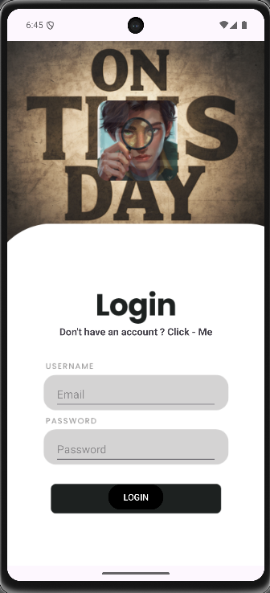
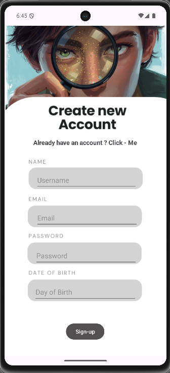
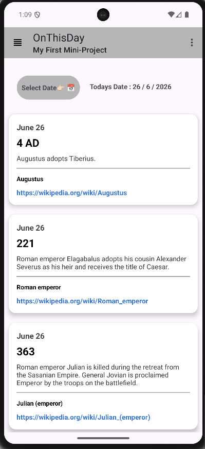

# 📅 On This Day

An Android application built with Kotlin that displays historical events that happened on a selected date. The app fetches real-time data from the On This Day API and presents it in a clean RecyclerView with custom CardViews.

---

## ✨ Features

- 📅 Date Picker for selecting any date
- 🌍 Historical events from around the world
- 📖 Displays:
  - Date
  - Year
  - Event Description
  - Wikipedia Reference
- 🔗 Clickable Wikipedia links
- 📜 RecyclerView with custom CardView design
- ⚡ Retrofit API Integration
- 🎨 Simple and clean UI
- 🧭 Toolbar with menu options
- 📱 Automatically loads today's events on app launch

---

## 📸 Screenshots

Login Page
<p align="center">
  
</p>
Register Page
<p align="center">
  
</p>
Main Activity
<p align="center">
  
</p>

---

## 🛠 Tech Stack

- **Language:** Kotlin
- **IDE:** Android Studio
- **Architecture:** Activity-Based
- **Networking:** Retrofit
- **JSON Parsing:** Gson Converter
- **UI Components:**
  - RecyclerView
  - CardView
  - Toolbar
  - DatePickerDialog
  - ConstraintLayout

---

## 🌐 API Used

### On This Day API

https://byabbe.se/on-this-day/

---

## 📂 Project Structure

```text
com.example.onthisday
│
├── MainActivity
│
├── Adapter
│   └── MyAdapter_for_recyclerview
│
├── Models
│   ├── wiki_data
│   ├── Event
│   └── Wikipedia
│
├── Network
│   └── wiki_interface
│
└── Layouts
    ├── activity_main.xml
    └── custom_layout_for_recyclerview.xml
```

---

## 🚀 How It Works

1. App starts and loads today's date.
2. Retrofit sends a request to the API.
3. Historical events are received.
4. RecyclerView displays the events.
5. User can select another date.
6. New data is fetched automatically.
7. Clicking a Wikipedia link opens the browser.

---

## 🎯 What I Learned

- Working with REST APIs
- Retrofit Integration
- Parsing JSON Responses
- RecyclerView & Custom Adapters
- CardView Design
- Intents and Browser Navigation
- DatePickerDialog
- Android UI Development

---

## 🔮 Future Improvements

- 🖼 Event Images using Wikipedia API
- ❤️ Save Favorite Events
- 📤 Share Events
- 🔍 Search Historical Events
- 🌙 Dark Mode
- 🏗 MVVM Architecture
- 📄 Event Detail Screen
- ⏳ Loading ProgressBar
- 📭 Empty State Handling

---

## 👨‍💻 Author

**Tejas Jadhav**

GitHub: https://github.com/tejasjadhav0704-sketch

---

## ⭐ Support

If you found this project useful, consider giving it a star on GitHub!
